Welcome screen displayed on different devices
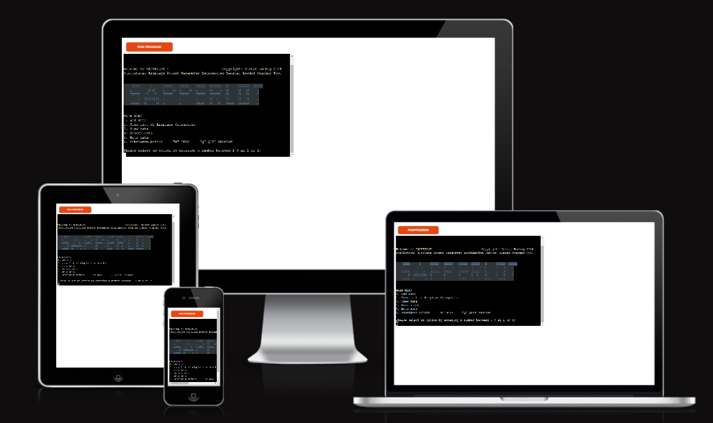
# SAPPERLOT

SAPPERLOT is a retro-style terminal program, written in python, that calculates parameters such as "Wing Area" and "Max Takeoff Weight" for planned aircraft designs using data from existing aircrafts. This generation of "start values" is achieved by creating and accessing a data base with aircrafts and interpolate/extrapolate these values. The programs also allow the user to update, search the database and analyse the data.

This program is targeting aircraft designers who would like to automate the process of generating start values for Design algorithms and methods within the field of Aircraft Conceptual Design.

The program name SAPPERLOT is a German interjection to exclaimed surprise, similar to "Oh my goodness!" It is also an acronym: "Statistical Airplane Potent Parameter Engineering Radical Loaded Oranges Tool" to parody industries often contrived projects acronyms.

### Fictive inspirational background story
The year is 1982 and the Swedish government has just given the go ahead for the development of a new national fighter aircraft. A few months earlier a newly graduated computer Scientist from Linköping University has started his first job at the conceptual design department at the national airplane manufacturer Saab in Linköping.

During a coffee break on a Friday afternoon he overhears some colleagues discussing the time-consuming process of manually guesstimating start values for the design algorithms. Eager to impress he calls his girlfriend saying that he can’t make it this weekend. Instead, he huddles over his Commadore 64 and when he leaves his apartment in the suburbs of Ryd Monday morning there is, in his backpack, a golden 3+1⁄2-inch floppy disk with a carefully written name: SAPPERLOT on its label. He bicycles with a new stride through the forest and walks into the department with a swagger feeling he is hot shit!

His colleague’s initial silent skepticism turns to raised eyebrows and happy chuckles as the command line prompt spits out the start values for the day. Today he is close to retirement but remembering that code and the early planning of JAS 39 Gripen still puts a sweet smile on his face.

<span style="color:orange">Please note: There is sometimes a delay of a few seconds before the welcome screen appears. We sincerely appologize for this inconvenience. For more information see section: "Unsolved bugs"</span>

[View the live project here.](https://sapperlot-8eb16827aadb.herokuapp.com/)

##  User Experience (UX)

- ### As a User, I want to be able to:
1. Clearly understand how to use and navigate the program.
2. Easily find a help-section with technical background info on how the results are being calculated.
3. Recieve feedback and help for my selections based on my previous selections, e.g. recieve info on data-set boundaries before inputting my interpolate-value.
4. Always be able to return to the main menu, the help section or to quit the program directly from where I am.
5. Be able to give invalid input without causing the program to crash.
6. Recieve valuable data with little effort.

## Program Structure
The program structure/flow chart below shows the overal structure and logic of SAPPERLOT. Some subfunctions/subroutines have been omitted in the chart for sake of clarity.

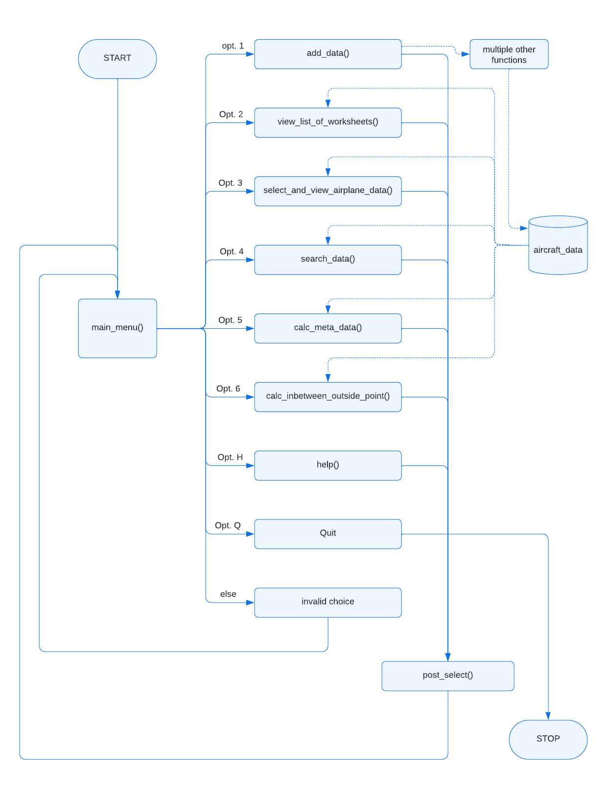

## Features
### Existing Features (In Scope Features)
#### 1. Cloud based spread sheet with aircraft data
[View the aircraft_data - sheet here.](https://docs.google.com/spreadsheets/d/186F_QSx24xYlkzunnzrzawt06MJO8GfdPsxGeRoqIa4/edit#gid=1680754323)
- Google sheet is an "excel clone" spreadsheet that SAPPERLOT use as a library to store aircraft data. The sheet can be accessed from the python code which can update and retrieve the whole sheet, individual tabs, columns, rows or specific cells.
- The filename of the sheet is: aircraft_data and it has three tabs at the bottom of the sheet:
  - multirole_fighter
  - airliner
  - general_aviation
- The user can also update the aircraft data directly into the sheet without running SAPPERLOT
- Currently deleting or editing data in the sheet needs to be done directly in the sheet since no function exist for this yet in SAPPERLOT.


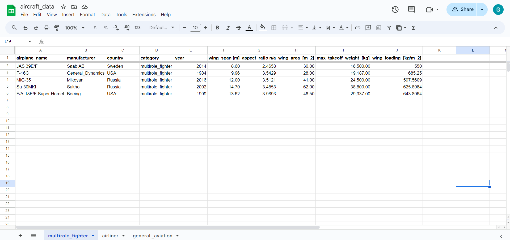

#### 2. Welcome message and main menu
- The program has six functions all accessed from the main menu:
1. Add data
2. View list of Airplane Categories
3. View data
4. Search data
5. Meta data
6. Inbetween points

- The user can also always choose "H" to be taken to the HELP section, "M" for going back to the main menu or "Q" if you had enough and want to QUIT the program, no matter from what submenu.
- Run the program by entering python3 run.py in the command line or click the orange "run programm"-button
- The Programm name/logo displays upon the start of the program together with a welcome message and the main menu.

The Welcome screen as it appear in gitpod:

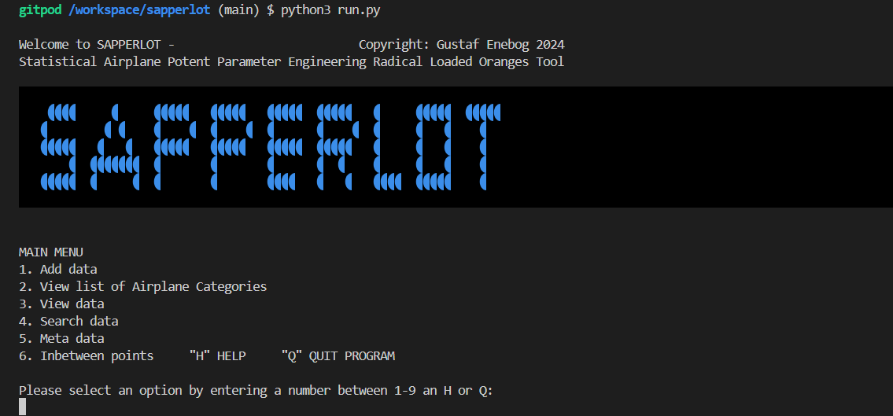

And the same Welcome screen as it appear in Heroku:

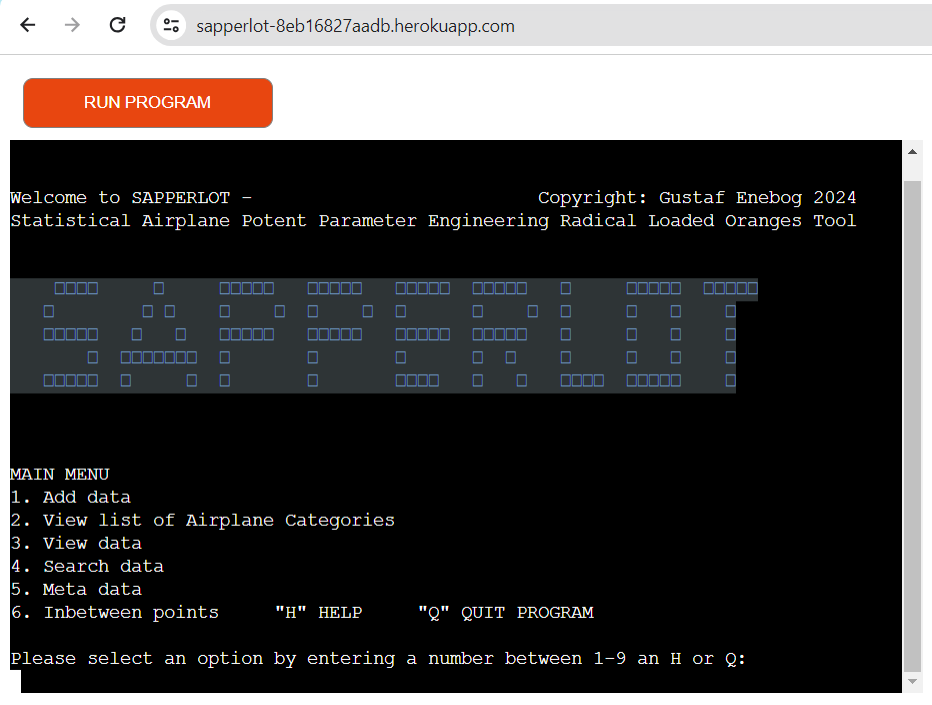


#### 3. Add data (main menu option 1.)
- The add_data() is the most complicated function using four subfunctions called by the add_data() (in the order they are written below):
1. get_airplane_data() - Prompts and recieves airplane user input
  - get_airplane_data() also in turn calls the validate_airplane_data() which test the inputed data (without changing) with the purpose of validating it. 
2. convert_to_int_and_float() - Leave the first four values as strings, Convert year (fifth value, index 4) to an int and the rest (sixth to ten, index 5 to 9) to float
3. uppdate_dependent_airplane_data() - Calculates the two missing parameters (inputed as zero by the user).
4. push_airplane_data_to_worksheet() - Updates the inputed values as a new row in correct category/tab in the google worksheet

- The five aircraft parameters are interdependent and inputting more than three parameters would therefore overdefine the data. For this reason the user need to first select which set of parameters to input. The rest of the parameters will be calculated by SAPPERLOT.
- After this the user can input the data for an aircraft as a Comma Separated Values (CSV).
- The user will be given feedback on which parameters to leave out (entering "0" as placeholders for these values) based on his selection.

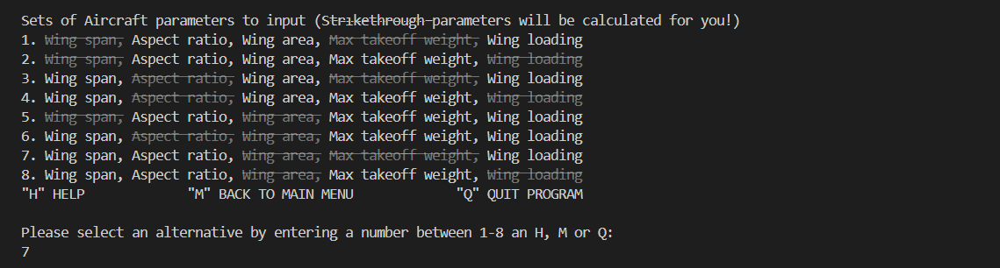

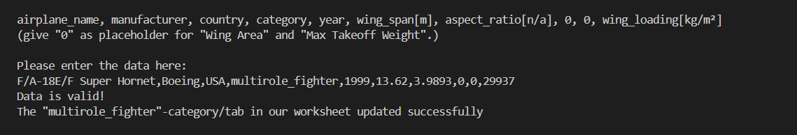

#### 4. Equations for calculation of dependent parables
- The uppdate_dependent_airplane_data() function calculates the two missing parameters (inputed as zero by the user). 
- This function display all the categories in the sheet aircraft_data (tabs in aircraft_data sheet).
- The function does not require any additional selection steps.
- If these would be inputed it would overdefine the user data. See the below equations used to calculate the dependent values.
wing_span, aspect_ratio, wing_area, take_off_gross_weight, wing_loading
wing_span, aspect_ratio, wing_area, take_off_gross_weight, wing_loading
wing_span, aspect_ratio, wing_area, take_off_gross_weight, wing_loading
wing_span, aspect_ratio, wing_area, take_off_gross_weight, wing_loading
wing_span, aspect_ratio, wing_area, take_off_gross_weight, wing_loading
wing_span, aspect_ratio, wing_area, take_off_gross_weight, wing_loading
wing_span, aspect_ratio, wing_area, take_off_gross_weight, wing_loading
wing_span, aspect_ratio, wing_area, take_off_gross_weight, wing_loading


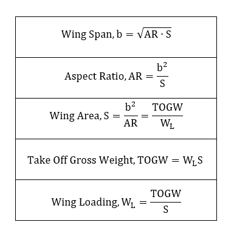


#### 5. View list of Airplane Categories (main menu option 2.)
- This function display all the categories in the sheet aircraft_data (tabs in aircraft_data sheet).
- The function does not require any additional selection steps.

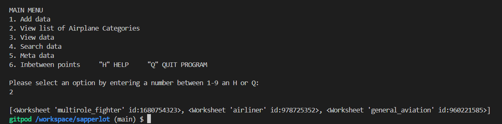


#### 6. View data (main menu option 3.)
- This function retrieve all data in the aircraft_data-sheet and display it as a simple printout to the screen.
- The function require the user only one selection namly that of "aircraft category".

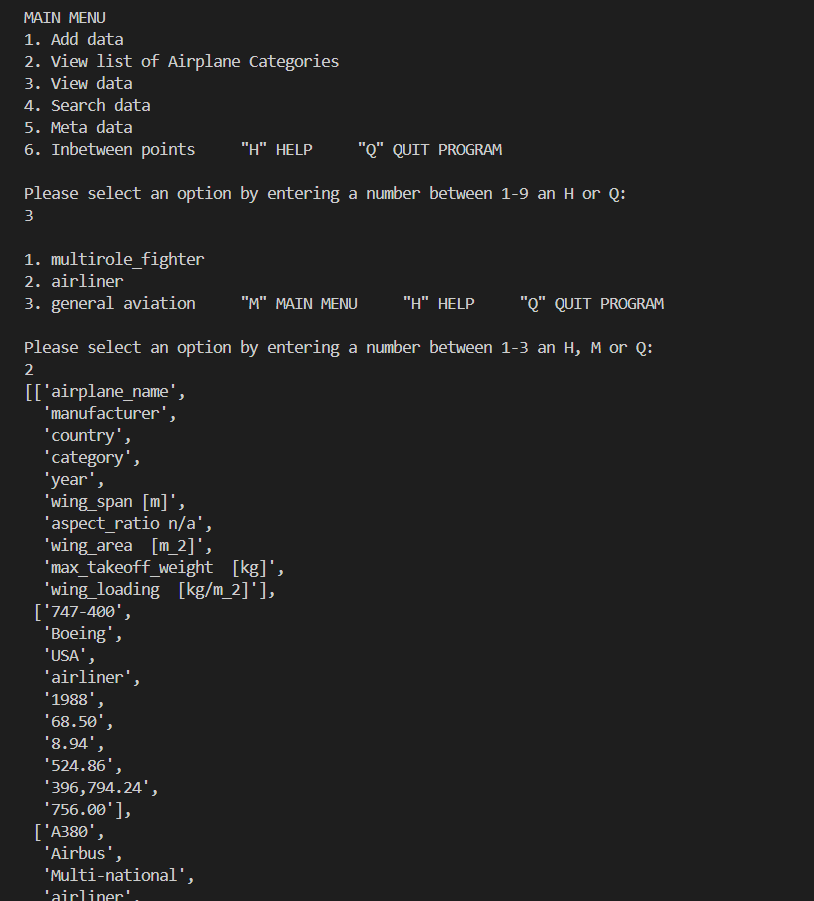


#### 7. Search data (main menu option 4.)
- This function allows the user to search the aircraft_data sheet for entries
- The user need to make two selection steps before he can enter the search term:
  1. category
  2. Exact word search or Regular expression (regex) search

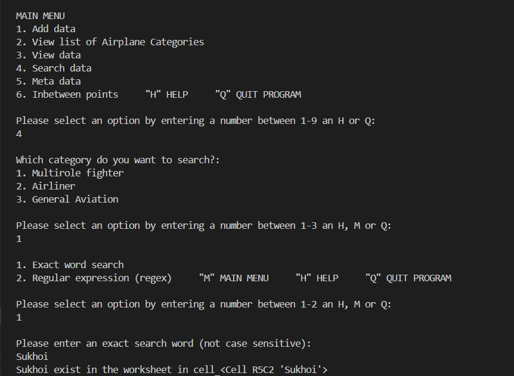

and for case of Regular expression, regex (case sensitive)

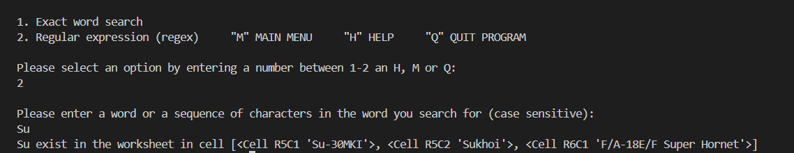


#### 8. Meta data (main menu option 5.)
- This function is simple to use (yet slightly more complex under the hood) and give the user info about the charactersitics of the "data base".
- The function does not require any additional selection steps.
- The three parameters: mean, median and variance is calculated using a built-in statistics module in python.

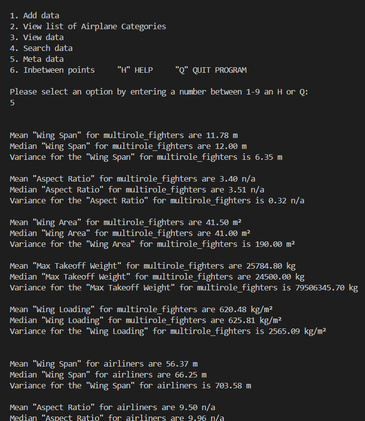

 
#### 9. Inbetween points (main menu option 6.)
- The function of interpolating points that lie between the datapoints really is the main purpose of SAPPERLOT.
- numpy.interp is used to interpolate the data. Numpy is a python module handling everything math and since it is written in C++ it is faster than Python's native list operations.
- The user need to make four selections/values before the "inbetween"-value is displayed
  1. category
  2. Aircraft data parameters (y-coord.) to calculate "inbetween"-value3
  3. Aircraft data parameters (x-coord.) to base "inbetween"-value on. Feedback on which parameter the user is not allowed to select is given.
  4. The interpolation value (y-coord.). Feed back on data set bounds are given

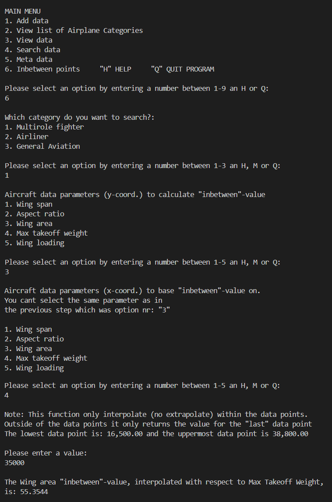


#### 10. Error handling
- All user selection processes tries to take care of incorrect user input without crashing by testing using a try and except-statement.
- The following user inputs errors are checked for:
  - Number of inputs (should be 10)
  - No commas in year
  - input Category (multirole_fighter, airliner or general_aviation) need to be spelled correctly (including underscore)

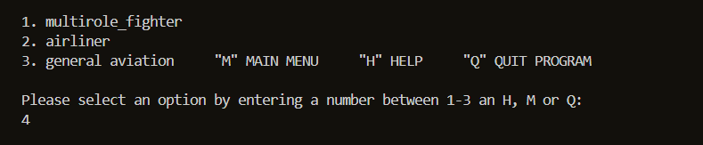

### Features Left to Implement (Out of Scope Features for a future release)
- Develop application for smartphones. 
- Options for ordering custom toppings.
- Email confirmation when the order is placed.
- Provide the customer with the opportunity to pay online.
- Provide the customer with an expected wait time dependent on current live orders.
- Providing graphic illustrations of aircraft data in general (graphs can be implemented in a CLI via e.g. pandas API)
- The addition of a Bell curve to the Meta data function
- Adding an edit_data and an delete_data function
- Review of complete code structure (espcialy the user selection process) to to evaluate if repeating code patterns could be abstracted away into separate functions in order to decrease complexity
- Create function to allow user to create new airplane categories/new tabs in google sheet
- Add units to answer in interpolation function 
- Store calculated interpolated values in a new tab in aircraft_data sheet


## UX Design


Structure and navigation
Upon opening of the program (with command ...) The Program logo with a welcome message appears followed by the Main menu consisting of 9 alternative commands each represented by a number to 

Representing user options with a number (as single letters) instead of command words is to make the user selection/typing process more expedient.

After the completion of a function/option the user will return to the main function.

The user can always get back to the main menu by writing M, quit the program typing Q or go to the Help section typing H. 

Rows and space
For optimal clearity and ease of ...

Graphics
 Retro style Command Line Interface graphics using rows of chars and space

Unicode Character “◗” (U+25D7)
- [Compart:](https://www.compart.com/en/unicode/U+25D7) "Half circle char used for creating retro style ".

- To Style the Welcome screen and to make the instructions to the user more easy to understand I have used the following code (ANSI escape codes and Colorama, built-in Python module) to print coloured text:

  - Blue for SAPPERLOT - logo: 033[1;34;40m
  - Grey with strikethrough: esc('238;2;9')

## Data-Model 

I have based the model on functions used as the steps to request, validate and return data from the customer. These functions are called from within the 'Place Order' function. As each function is executed, return values are collated and confirmed back to the user before sending to the kitchen. 

An external Google Sheet is used to receive this data in a format the kitchen can read, execute and update the order status. The Owner also uses this Sheet to update the menu for the day, and any cost changes. Pandas DataFrames is used to receive the data into the application. DataFrames are formatted using Tabulate for customer views.

The Google Sheet can be viewed online at [VV Pizzas](https://docs.google.com/spreadsheets/d/1-0Hu5_4mXknpqb36h5K3NuboPPn9xHJsGvmpaZjTMtU/edit#gid=1680754323). Data within is for the purposes of the MVP and therefore fictitious.

## Technologies Used

- Python.
- [Am I Responsive:](http://ami.responsivedesign.is) Checking the responsive.
- [PEP8:](http://pep8online.com/) Check your code for PEP8 requirements.
- [autopep8:](https://pypi.org/project/autopep8/) Check your code for PEP8 requirements (command: autopep8 --in-place --aggressive --aggressive -r *.py)
- [Lucidchart:](https://www.lucidchart.com/pages/) Used to create flow charts.
- [Git](https://www.gitpod.io/) Git was used for version control by utilizing the Gitpod terminal to commit to Git and Push to GitHub.
- [GitHub:](https://github.com/) Used for string code (pushed from GitPod to GitHub)
- [Heroku:](https://devcenter.heroku.com/articles/heroku-dashboard) Used for deployment of application.


## Testing

### Validator Testing 

PEP8 Online linter (Python validator)
The code passed without any errors.

- PEP8 online


### Functionality
large lifted out table

### Further Testing

  #### I have validated that:

  - the dependent values (calcuated by the program based on user input) are correct 
  - That all combinations of selections runs as expectedly, e.g. category: opt 1 multirole_fighter -> opt 2. Regular expression (regex)
  - data in the wrong form, e.g. decimal number inputed as a year,inputted is handled without causing program to crash 

  #### I have tested that:

  - Logo, welcome text and all printe statements work and displays correctly in terms of:
    -color
    -striklethrough
    -empty rows new row using the new line character “\n”
  - x.
  - x.

### User Stories

User stories have been tested and below you can see which features support which stories:

User stories are numbered 1 to 7 and the features are:
  1. Welcome message
  2. Rules
  3. Setup
  4. Game area
  5. Result

| ID | User 


large lifted out table (below)

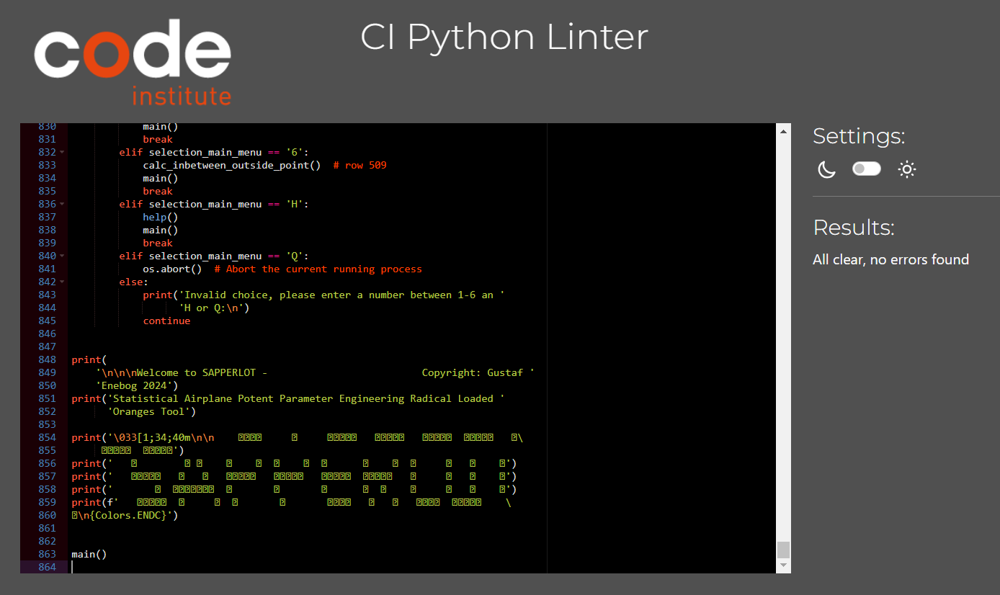

### Solved bugs

- Remove "thousands separator" (added by google sheet) to allow conversion to float and int
values_list[k] = values_list[k].replace(',', '')
- For loops not adding 1 to max index thus failing to run last loop
- Using the index of the second nested loop instead of the index of the third nested loop
- Stop styling to continue after the place it was supposed to be applied too.
- Not able to convert year to int
- numpy dependency had not been included in the deployment to Heroku since it was not included in the requirements.txt - file. Solution: run pip freeze --local > requirements.txt in the command line to include numpy (numpy==1.26.4) in the requirements.txt - file and then push to gitHub.
- PROBLEM: Printout statement typing variable name (in f-string placeholder) instead of its value
  - SOLUTION: Repeating the f in the f-strings on each new line after wraping long lines.


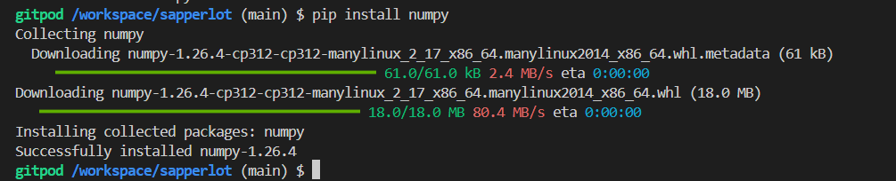

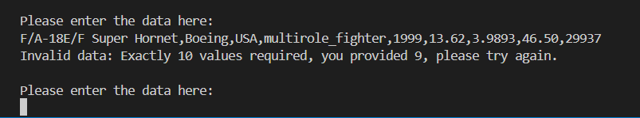

### Known bugs

<span style="color:orange">IMPORTANT! There is a 3 min + long delay for the program to run (for the welcome screen to appear) just be patient! We sincerely appologize for this frustrating inconvenience. For more information see section: "Unsolved bugs"</span>
- When the search function yields no result the only way to understand that is that the result is empty but the text still says that the result IS found
- Relating to deployment on Heroku:
  - The most serious bug is a 3 min + delay for the program to run (for the welcome screen to appear) loading the heroku URL (or after clickign the orange "run program" -button). This might be due to a slow loading time for some library or similar. The equvilant loading time in gitpod was 3 seconds which is also out of the norm. Testing with removing libaries and test loading has been carried out with no solution. Solution was probably after linting!
  - When the search function yields no result the only way to understand that is that the result is empty but the text still says that the result IS found
  - This is not really a bug however since colorama api does not works with heroku the logo displays with a a wrong character and a grey background (instead of black)
  - Also not a bug is that Heroku display the text with no left margin.
  - Can not go to help, main menu or quit when in in option 1 Add data's second submenu: Please enter the data here:

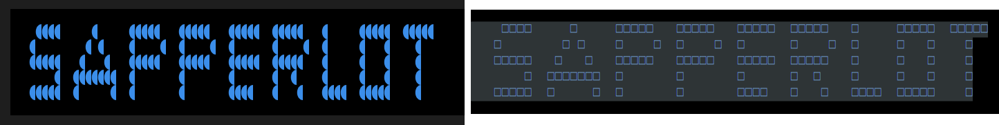

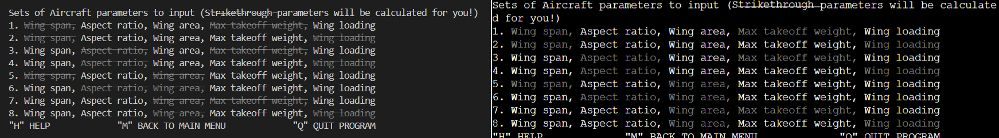

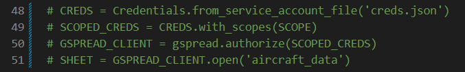

## Deployment
<span style="color:orange">IMPORTANT! There is a 3 min + long delay for the program to run (for the welcome screen to appear) just be patient! We sincerely appologize for this frustrating inconvenience. For more information see section: "Unsolved bugs"</span>

which runs in the Code Institute mock terminal on Heroku.

https://sapperlot-8eb16827aadb.herokuapp.com/

The site was deployed to Heroku. The steps to deploy are as follows:
  1. Log in to Heroku.
  2. Click "Create new app".
  3. Choose app name and choose a region.
  4. Click "Create app".
  5. Navigate to the "settings" tab.
  6. "Click "Reveal Config Vars".
  7. Add Config Var in Heroku's Settings. The key is PORT and the value is 8000
  8. Scroll down to "Buildpacks".
  9. Click "Add Buildpack".
  10. First add "python", click save.
  11. Second add "nodejs", click save.

### Automated Deployments from GitHub disabled by Heroku.

Follow the steps below to deploy from your Gitpod workspace:
  1. Open the terminal.
  2. command: heroku login -i
  3. Get your app name from heroku.
  4. command: heroku apps
  5. Set the heroku remote. (Replace <app_name> with your actual app name and remove the <> characters)
  6. command: heroku git:remote -a <app_name>
  7. Add and commit any changes to your code if applicable
  8. command: git add . && git commit -m "Deploy to Heroku via CLI"
  9. Push to both GitHub and Heroku
  10. command: git push origin main
  11. command: git push heroku main

## Credits

- Credit Love Sandwiches
- [REPLACE!!!!!!!!!!!!:](http://ami.responsivedesign.is) Checking the responsive.
- [Stackoverflow:](https://stackoverflow.com/questions/287871/how-do-i-print-colored-text-to-the-terminal) How do I print colored text to the terminal.


### Acknowledgements

- My mentor Brian Macharia for his review of the code and feedback!


## Credit

### People

* Mentor Brian Macharia for guiding and advising throughout the projects lifecycle on how to improve UX and my code.

Support with how to develop ideas into code also came from various online resources:

* [Validating Mobile Phone Number Format](https://stackoverflow.com/questions/16135069/how-do-i-validate-a-mobile-number-using-python)
* [Converting String Inputs to Integers](https://stackoverflow.com/questions/13207697/how-to-remove-square-brackets-from-list-in-python)
* [Applying Date and Time to Orders](https://www.programiz.com/python-programming/datetime/current-datetime)
* [Clearing Screen Between Menus](https://www.geeksforgeeks.org/clear-screen-python/)
* [Adding Time Delay to Function Calls](https://www.pythoncentral.io/pythons-time-sleep-pause-wait-sleep-stop-your-code/)
* [Visualising a Progress Bar](https://www.freecodecamp.org/news/use-the-rich-library-in-python/)
* [Providing System Exit Method](https://stackoverflow.com/questions/543309/programmatically-stop-execution-of-python-script)


### Python Library Dependencies and Packages

* [Google Sheet](https://docs.google.com/spreadsheets/d/1-0Hu5_4mXknpqb36h5K3NuboPPn9xHJsGvmpaZjTMtU/edit#gid=1680754323) to display the orders for the kitchen, and to allow the Owner to update the menu and cost.
* [Rich Console](https://rich.readthedocs.io/en/stable/console.html) to style terminal text, provide a Progress Bar when sending orders, and as formatted traceback for development.
* [Pandas](https://pandas.pydata.org/) to receive data from the external Google Sheet into a DataFrame.
* [Tabulate](https://pypi.org/project/tabulate/) to render pandas DataFrames.
* [Regular Expression (or RE)](https://docs.python.org/3/library/re.html) to validate the customers mobile number structure
* [Datetime](https://docs.python.org/3/library/datetime.html) to add the date and time to the order before sending to the kitchen.
* [Time](https://docs.python.org/3/library/time.html) in conjunction with [Sleep](https://realpython.com/python-sleep/) to delay functions executing which for the customer provides time to read messages before moving to the next screen. 


### Software & Web Applications

* [Balsamiq](https://balsamiq.com/) - Used to build wireframes in the Skelton phase.
* [LucidChart](https://www.lucidchart.com/pages/) - To map out the flow of data.
* This website was coded primarily using Python3, HTML5, CCS3 with [GitPod](https://gitpod.io/) used for the IDE and [GitHub](https://github.com/) as a hosting repository.
* [W3schools](https://www.w3schools.com/) - Source of 'How to...' information throughout the build.
* [Stack Overflow](https://stackoverflow.com/) - Source of 'How to...' information on Python code.
* [Python Tutor](https://pythontutor.com/) - For testing sections of code.
* [Wave](https://wave.webaim.org/) - Accessibility Testing to ensure content is readable for all users.
* [HTML Validator](https://validator.w3.org/) - For validating HMTL code.
* [W3 CSS Validator](https://jigsaw.w3.org/css-validator/validator) - For validating CSS code.
* [PEP8 Validator](http://pep8online.com/)  - For validating Python code.
* [Code Beautify](https://codebeautify.org/) - For validating the layout of code.
* [IE NetREnderer](https://netrenderer.com/index.php) - For browser testing on Microsoft IE versions 7-10.
* [LambdaTest](https://www.lambdatest.com/) - For cross browser testing including, macOS Safari and Opera.


Tried to avoid global variables


| ID | Test Label                              | Test Action                                                                                                                                                                                | Expected Outcome                                                                                                                                                                                                                                                                                                                                                                                                                                                       | Test Outcome                                                                        |                                                                                                                                                                                                                                                                                                            
|----|---------------------------------------- |--------------------------------------------------------------------------------------------------------------------------------------------------------------------------------------------|------------------------------------------------------------------------------------------------------------------------------------------------------------------------------------------------------------------------------------------------------------------------------------------------------------------------------------------------------------------------------------------------------------------------------------------------------------------------|-------------------------------------------------------------------------------------|
|  1 | Welcome To My Hangman Game!             | Run program                                                                                                                                                                                | The user is presented with a welcome message and the ASCII hangman. The user is then prompted to start the game.                                                                                                                                                                                                                                                                                                                                                       | PASS                                                                                |                                                                                                                                                                                                                                                                                                                                                                                                                                                                                                                                                                                                                       
|  2 | Start / Do you want to play? y/n        | User is required to input (y or Y) / (n or N), invalid input will result in an error message to the user.                                                                                  | (y or Y) - The user is presented with the following message: (feedback) you have decided to play. (n or N) - The user is presented with the following message: Exiting Game. - The game closes. An error message informs the user if their entry is not in the correct format: ”That is not a valid option, Please try again.”                                                                                                                                         | PASS                                                                                |                                                                                                                                                                                                                                                                                                           
|  3 | Rules / Read the rules? y/n             | User is required to input (y or Y) / (n or N), invalid input will result in an error message to the user.                                                                                  | (y or Y) - The user is presented with the rules of the game. (n or N) - The user is presented with the following message: (feedback), no rules. An error message informs the user if their entry is not in the correct format: ”That is not a valid option, Please try again.”                                                                                                                                                                                         | PASS                                                                                |                                                                                                                                                                                                                                                                                                                                                                                                                                                                                                                                                                                                                       
|  4 | Setup / Name and Favourite colour       | User is required to input name and favourite colour only alphabet letters, 2 characters or more is accepted.                                                                               | The user is then prompted to enter name and favourite colour. A short print statement will be presented to the user after each validated input. An error message informs the user if their entry is not in the correct format: ”That is not a valid option, Please try again.”                                                                                                                                                                                         | PASS                                                                                |                                                                                                                                                                                                                                                                                                                                                                                                                                                                                                                                                                                                                       
|  5 | Setup / Age                             | User is required to input age, user must enter a number here to proceed.                                                                                                                   | The user is prompted to enter age. A short print statement will be presented to the user after validated age input. An error message informs the user if their entry is not in the correct format: ”That is not a valid option, Please try again.” If age < 5 the following message will be presented to the user: You are too young to play this game! - The game closes.                                                                                             | PASS                                                                                |                                                                                                                                                                                                                                                                                                                                                                                                                                                                                                                                                                                                                       
|  6 | Display / Favourite colour              | If the user input matches with any key in the colours dictionary otherwise a random colour is chosen. Used to display the ASCII hangman in different colours depending on user input.      | User choice matches with a key in the colours dictionary, the following message is presented: (colour) is (feedback). Otherwise a random colour is chosen and the message is: (colour) not listed. (colour) was chosen instead. Both the ASCII hangman and the secret word will be printed in the chosen favourite colour.                                                                                                                                             | PASS                                                                                |                                                                                                                                                                                                                                                                                                                                                                                                                                                                                                                                                                                                                      
|  7 | Game Area / Chosen Word                 | The word to guess is represented by a row of dashes representing each letter of the word. The difficulty of the word depends on age input.                                                 | If user age is below 16 years a word from the easy_words file is presented otherwise a word from hard_words file is chosen.                                                                                                                                                                                                                                                                                                                                            | PASS                                                                                |                                                                                                                                                                                                                                                                                                                                                                                                                                                                                                                                                                                                                      
|  8 | Game Area / Choose A Letter             | User is prompted to choose a letter to guess.                                                                                                                                              | Only one alphabet letter is accepted or an error message is displayed: ”That is not a valid option, Please try again.” When the user enters an already guessed letter again the following message appears: You already tried: (letter). This will not increment the failed attempts count.                                                                                                                                                                             | PASS                                                                                |                                                                                                                                                                                                                                                                                                                                                                                                                                                                                                                                                                                                                       
|  9 | Game Area / Failed Attempts             | User enters a letter that is not in the secret word to guess.                                                                                                                              | Failed Attempts count should increment by 1 and the terminal will print one element of the ASCII hangman. The number of tries before the game ends is 7.                                                                                                                                                                                                                                                                                                               | PASS                                                                                |                                                                                                                                                                                                                                                                                                                                                                                                                                                                                                                                                                                                                      
| 10 | Game Area / Result                      | The user finds the secret word or failed attempts count reaches 7.                                                                                                                         | The user is presented with a short message and what the secret word was. Then the user is prompted to play again.                                                                                                                                                                                                                                                                                                                                                      | PASS                                                                                |                                                                                                                                                                                                                                                                                                                                                                                                                                                                                                                                                                                                                       
| 11 | Result / Play Again? y/n                | User is required to input (y or Y) / (n or N), invalid input will result in an error message to the user.                                                                                  | (y or Y) - The user is presented with the following message: (feedback) you have decided to play again. - The user will be presented with a new word to guess. (n or N) - The user is presented with the following message: Exiting Game. - The game closes. An error message informs the user if their entry is not in the correct format: ”That is not a valid option, Please try again.”                                                                            | PASS                                                                                |                                                                                                                                                                                                                                                                                                                                                                                                                                                                                                                                                                                                                      


Stories                                                                                                                                                   | Features      |                                                                                                                                                                                                                                                                                                                                                                                                                                                                                                                                                                                                                                                                                                                                                                                                                                                                                                                                
|----|----------------------------------------------------------------------------------------------------------------------------------------------------------------|---------------|
|  1 | Clearly understand how to navigate and start the game.                                                                                                         | 1, 2, 3       | 
|  2 | Easily find instructions on how to play the game.                                                                                                              | 2             |                                                                                                                                                                                                                                                                                                                                                                                                                                                                                                                                                                                                                                                                                                                                                                                                                                                                                                                                                                                                                                                                                                                                  
|  3 | Understand what input is required to proceed and that any exception is returned with a message to the user without causing the game to crash.                  | 1, 2, 3, 4, 5 |                                                                                                                                                                                                                                                                                                                                                                                                                                                                                                                                                                                                                                                                                                                                                                                                                                                                                                                                                                                                                                                                                                                                  
|  4 | Clearly see the number of incorrect guesses before the game ends.                                                                                              | 4             |   
|  5 | Clearly see what the secret word was if the user fails to guess it before the game ends.                                                                       | 5             |                                                                                                                                                                                                                                                                                                                                                                                                                                                                                                                                                                                                                                                                                                                                                                                                                                                                                                                                                                                                                                                                                                                                  
|  6 | Continue playing the game once the game has finished without having to reenter the initial inputs from when the game started.                                  | 5             |                                                                                                                                                                                                                                                                                                                                                                                                                                                                                                                                                                                                                                                                                                                                                                                                                                                                                                                                                                                                                                                                                                                                  
|  7 | Have a fun time playing the game and that it functions as expected.                                                                                            | 1, 2, 3, 4, 5 |                                                                                                                                                                                                                                                                                                                                                                                                                                                                                                                                                                                                                                                                                                                                                                                                                                                                                                                                                                                                                                                                                                                                  


# VV Pizzas

<p align="center">
  
</p>

[Link to Website](https://vv-pizzas.herokuapp.com/)

[GitHub Repo](https://github.com/RickofManc/vv-pizzas)


***

## About

Vera's Vegan Pizzas is a popular South Manchester based food truck. The popularity of this delicious "can't believe it's vegan" pizza often leads to long wait times to order. Whilst most customers are happy to wait, Vera feels she is losing customers before they order due to an absence of online ordering. Currently, there is a single point of contact to place orders by phone, and if this is frequently engaged, some customers order elsewhere.  


***


## Index - Table of Contents

* [User Experience R&D](#user-experience-research-and-design)
    * [Strategy](#Strategy)
    * [Scope](#Scope)
    * [Structure](Structure)
    * [Skeleton](#Skeleton)
    * [Surface](#Surface)
* [Features](#Features)
* [Data Model](#Data-Model)
* [Manual Testing](#Manual-Testing)
* [Deployment](#Deployment)
* [Credits](#Credit)


***


## User Experience Research and Design


### Strategy

Vera requires a solution that provides a new method for customers to place orders. An online based ordering system should be simple, and clear in design and layout,  taking a similar duration to ordering by phone. 

A successful solution should reduce the amount of calls Vera is handling to allow her to focus on cooking.
Furthermore, as the orders will be received digitally to a Google based spreadsheet, Vera will be able to execute them in order from viewing the spreadsheet on screen.

There are additional benefits of moving to a digitally driven ordering system; in that Vera will have order data and her fingertips. Allowing Vera to analyse and forecast stock levels for a particular day and/or location far easier than the current paper-based method. Vera will also be able amend the menu and costs within the spreadsheet negating the requirement for Developer services to update within the code.


#### Leading User Stories

* As a customer... 
    * I want to place an order at the first time of trying, so that I don't have to keep calling back.
    * I want to understand how long it will take to cook my order, so that I can plan my journey time.
    * I want to learn which pizzas are available, so I can choose my preferred option.
    * I want to learn which sizes are available, so I can choose the appropriate size for my appetite.
    * I want to order multiple pizzas, so I can provide food to more people.
    * I want to be able to amend the order before committing, so that if a mistake is made I don't have to restart the order.
* As the owner... 
    * I want to reduce the time spent on the phone and writing orders, so I can focus on executing the orders.
    * I want to provide an easier method of ordering pizza, so that our orders increase.
    * I want to be able to inform customers of changes to the menu daily, so I can try new toppings and improve customer satisfaction.
    * I want to have data from the day's orders, so that I can learn of customers trends and forecast more accurately.


#### Primary strategic aims for the website
* The application will provide a method of receiving and executing orders from Vera's customers.
* The application will be intuitive for the customer to follow and take a similar amount of time as if ordering by phone.
* Customers who had previously ordered elsewhere due a continually engaged phone line, will place an order online, which in turn will increase revenue.


The roadmap below highlights the high-level strategic opportunities versus the importance and viability/feasibility of development for the MVP (Minimal Viable Product):

<p align="center">
  
</p>


### Scope

An agile approach of keeping the in scope features simple and aligned to the strategy for the MVP will be adopted.
Below is a list of the leading features for the application.

#### In Scope Features
* Create an online interface for customers to place orders.
* A welcome message.
* Options for ordering different pizza sizes.
* Options for ordering different pizza toppings.
* On screen confirmation of the order before placing with Vera.
* Provide the order details in a spreadsheet to Vera as they are received.
* Provide the customer with a cost to be paid on collection.
* Add the value of each order within the spreadsheet.

#### Out of Scope Features (for a future release)
* Develop application for smartphones. 
* Options for ordering custom toppings.
* Email confirmation when the order is placed.
* Provide the customer with the opportunity to pay online.
* Provide the customer with an expected wait time dependent on current live orders.


### Structure

This website will be structured with the following design considerations.
* The customer will be welcomed to the CLI (Command Line Interface) with a welcome message from Vera.
* The customer will be asked for basic details, including their name which could be used as the order reference for the MVP.
* The customer will then be asked which pizza they would like from the menu.
* This will be followed by the size of pizza they would like; Small, Medium, Large
* Confirmation of their order will be provided, asking them whether they would like to place the order, or order anything else.
* If the customer needs to order more items they will be navigated back the first ordering question.
* If the customer has requested all items then the order will be placed, and the Google Sheet updated for Vera.
* Finally, the customer will be thanked and informed of the time for collection. customer.

The final structure may differ slightly as development progresses and from user feedback.


### Skeleton

Key to the UX attributes is the ease for which customers can place an order. Therefore, the website will contain a simple interface that immediately welcomes the customers and takes them through the process with minimal inputs.

The journey should take a similar amount of time to when ordering by phone which should ensure no customers are lost with the change in method. 

Aesthetically the page will be clean with no images, and a clear header informing the user they are ordering with VV Pizzas. Use of the national colours of Italy will provide signals of the food theme. Within the interface, Emoji's will be used to communicate some fun. However, they will not be used to replace words to avoid any confusion with the customer.

Should the customer make an error whilst navigating through the system, a message will appear guiding them on the steps to take, whilst also having the ability to navigate to the Main Menu and exit the system. Furthermore, customers will have the ability to restart the order from within the interface or  by clicking a 'Restart Order' button located on the browser page.

#### Flowchart

A flowchart outlining the customer journey has been created using [Lucidchart](https://www.lucidchart.com/pages/). The final application may differ slightly as development progresses and from user feedback.

<p align="center">
    
</p>


#### Wireframe

As part of this phase a wireframe for a browser has been produced using [Balsamiq](https://balsamiq.com/wireframes/) (see image below - the wireframe is located within the project [Repo](https://github.com/RickofManc/vv-pizzas)).

The website is responsive through differing screen widths to a minimum of 800px wide. It is not yet developed for smartphones - a future sprint should see this delivered. 

<p align="center">
    
</p>


### Surface 

The key aim for the MVP launch is to have a readable interface for the customer to order. Therefore, the surface theme has retained a simple and clean style.


#### Colour 

The colour palette signals 'Italy' to the customer, to convey the link with the Italian food of pizza. The Savoy Azure Blue works well to provide accents; however, it does not work as well within the interface against the black background. Whereas the Green and Red from the Italian flag are readable against the background. However, they have not been overly used to ensure all critical text is readable. The Philippine Green from the Italian flag has also been used for the webpage background, as well as communicating Italy food, Green is often associated with Vegan or Vegetarian food.


<p align="center">
    
</p>


#### Font

'Fira Code' font has been selected for free commercial use from Google Fonts due to its similar style to the interface font. Fira Code is an extension of the Fira Mono font containing a set of ligatures for common programming multi-character combinations. Whilst these ligatures won't be used within this build, it does highlight the font is quick and easy to read.

<p align="center">
    
</p


***

## Features

### Current Features

* A welcome message greets the customer
<p align="center">
    
</p

* As the order process starts, the customer is asked for their name and mobile phone number
* An error message informs the customer if their entry is not in the correct format
<p align="center">
    
</p>

* A table presenting the days choice of pizza is displayed. The customer is asked to make a choice to proceed or has options to navigate elsewhere.
<p align="center">
    
</p>

* A table presenting the options for sizes and the cost is displayed. The customer is asked to make a choice to proceed or has options to navigate elsewhere.
<p align="center">
    
</p>

* Following a choice of pizza and size, the customer is asked how many they would like to order.
<p align="center">
    
</p>

* The customers choices are played back to them, asking for confirmation to proceed sending the order to the kitchen.
<p align="center">
    
</p>

* The customer's order is being sent to the kitchen.
<p align="center">
    
</p>

* From the Main Menu, users can choose to view the current live orders to anticipate when theirs will be ready within the 20 minutes window.
* Sensitive data such as phone number and cost have been removed from view.
<p align="center">
    
</p>


### Future Features

Following a successful MVP launch, the application can be further developed over a brief period to improve UX.
Here are the immediate development roadmap features:
* Place an order on smartphones
* Website features i.e. About, Contact, Map, Social Media
* Pay online prior to collection
* Real-time update on the order to customer via email/SMS


### Meta data

Meta data is included within the HTML head element to increase the traffic to the website. Furthermore, the site page is titled appropriately as another method of informing users of their location.


***


***


## Manual Testing 

Throughout the Build phase Python Tutor, PEP8 Online and Chrome Developer Tools are used to ensure the application is intuitive, responsive and accessible. These tools and others were used for the Testing phase. Full details and results of testing be found within the project [Repo](readme-documents).

The following sections summarise the tests and results.


### Code 

The code on each file has been assessed using the appropriate validation service; W3C Markup for HTML, W3C for CSS (within the HTML files) and PEP8 Online for Python.

Below are the summarised results from these tests:

* **run.py** - 0 Errors / 0 Warnings
* **layout.html** - 0 Errors / 0 Warnings
* **index.html** - 1 Errors / 2 Warnings; relating to the absence of boiler plate ```<!DOCTYPE HTML>``` code which is anticipated given the structure of the website. This data is coded in the layout.html file along with the Head element.


### Browser

The website renders and is functional on the following browsers:
* Google Chrome
* Mozilla Firefox
* Safari
* Opera
* Microsoft Edge
* Microsoft Internet Explorer

The website does not render on any previous versions of Internet Explorer.


### Device

As anticipated the website was not functional on smartphones or tablet due primarily to terminal dimensions being fixed. However, functionality was as planned on devices that incorporated a keyboard to support navigation through the application. No issues were identified with desktop and laptop testing.


### Accessibility 

The homepage has been tested using the [Wave (Web Accessibility Evaluation Tool)](https://wave.webaim.org/) with zero alerts and only 1 contrast error where the Footer text was triggering a low-contrast error. As a result, I increased the size of the text and separated over two lines to improve readability for users with low-vision. 


### Performance 

Using Lighthouse performance testing within Chrome Developer Tools, the website has been tested for use on Desktop only. The website scored highly across all criteria; however, some further work is required to improve the contrast of the background to foreground for Accessibility, and potentially to use passive listeners to improve scrolling performance. Furthermore, the initial load time could be improved by eliminating render-blocking resources.

Test occurred using Lighthouse within Chrome Dev Tools on 16/03/2022 with the following results:

<p align="center">
    
</p>


### User Stories

The leading user stories have been tested to ensure the priority aims of the website have been delivered. 
Below is a summary of the story's validation.

Reference  | Description                                                                                                                                                                                     
---------- | ------------------------------------------------------------------------------------------------------------------------------------------------------------------------------------------------
US01       | As a customer, I want to place an order with VV Pizzas at the first time of trying, so that I don't have to keep calling back.                                                                  
Validation | Customers can navigate to the website and place an order online                                                                                                                                 
US02       | As a customer, I want to understand how long it will take to cook my order, so that I can plan my journey time.                                                                                 
Validation | Customers are advised to collect 20 minutes after they order, furthermore there is an option to 'View Live Orders' to check the order status. This is currently updated manually by the kitchen.
US03       | As a customer, I want to learn which pizzas are available, so I can choose my preferred option.                                                                                                 
Validation | In step 3 of placing an order, the menu highlighting which 4 pizzas are available is displayed.                                                                                                 
US04       | As a customer, I want to learn which sizes are available, so I can choose the appropriate size for my appetite.                                                                                 
Validation | In step 4 of placing an order, a table is displayed showing the size options and the respective cost.                                                                                           
US05       | As a customer, I want to order multiple pizzas, so I can provide food to more people.                                                                                                           
Validation | In step 5 of placing an order, the customer is asked to choose a quantity between 1-6.                                                                                                          
US06       | As a customer, I want to be able to amend the order before committing, so that if a mistake is made I don't have to restart the order.                                                          
Validation | This user story has not been deployed - several differing solutions to build this functionality have been attempted. Further time is required.                                                  
US07       | As the owner, I want to reduce the time spent on the phone and writing orders, so I can focus on executing the orders.                                                                          
Validation | Vera can view orders as they are received on a screen within the kitchen.                                                                                                                       
US08       | As the owner, I want to provide an easier method of ordering pizza, so that our orders increase.                                                                                                
Validation | Vera can communicate the website address to customers so they can use this method next time.                                                                                                    
US09       | I want to be able to inform customers of changes to the menu daily, so I can try new toppings and improve customer satisfaction.                                                                
Validation | Vera can update the menu daily from within the external spreadsheet - this then populates the table within the code that the customer sees.                                                     
US10       | As the owner, I want to have data from the day's orders, so that I can learn of customers trends and forecast more accurately.                                                                   
Validation | Vera can copy the data received on the order spreadsheet and paste into a data model that performance this type of analysis.                                                                    


### Bugs

The issues listed in the table below we identified during March 2022.


Ref | Bug                                           | Description                                                                                                                                                                                                                                                                                                                           | Resolved | Fix / Latest Update                                                                                                                                                                                                                                                                                                                                                                                                                                                                                                           
--- | --------------------------------------------- | ------------------------------------------------------------------------------------------------------------------------------------------------------------------------------------------------------------------------------------------------------------------------------------------------------------------------------------- | -------- | ------------------------------------------------------------------------------------------------------------------------------------------------------------------------------------------------------------------------------------------------------------------------------------------------------------------------------------------------------------------------------------------------------------------------------------------------------------------------------------------------------------------------------
B1  | Capital input for pizza size                  | Currently the only accepted input for a pizza size is a capital S, M or L                                                                                                                                                                                                                                                             | :heavy_check_mark: | Incorporate .upper() to the variable received from the users input                                                                                                                                                                                                                                                                                                                                                                                                                                                            
B2  | More than 11 digits allowed for mobile number | The user is asked to input their mobile phone number, which is validated using RE Compile and Match methods. However more than 11 digits were being accepted                                                                                                                                                                          | :heavy_check_mark: | Solution found within stackoverflow forums on the right code combination to use for UK mobile formats to match against.                                                                                                                                                                                                                                                                                                                                                                                                       
B3  | Displaying row data from external spreadsheet | Using Rich tables the row data from the Google Sheet will not display on new lines, instead it displays as columns                                                                                                                                                                                                                    | :heavy_check_mark: | This was an exhaustive bug to fix; I could not successfully code the right method to unpack the row data into the table.<br><br>I spent a vast amount of time trying to fix this bug as I wanted to use Rich tables to style the data, however in the end I found using a Pandas DataFrame would be quicker for now.                                                                                                                                                                                                          
B4  | Pandas DataFrame not rendering                | With styles applied to format the DataFrame, it would no longer render in the terminal                                                                                                                                                                                                                                                | :heavy_check_mark: | After trying several differing methods, including the use of Jinja the complexity was too great for the MVP.<br><br>I decided to use Tabulate to format the DataFrame within the code which renders simply, but readable.                                                                                                                                                                                                                                                                                                     
B5  | Pep8 error when using a lambda expression     | As part of the solution to use the GBP £ for cost I installed and setup the right 'locales' packages. To invoke this a line of code was required using 'lambda'                                                                                                                                                                       | :heavy_check_mark: | This format triggered an E731 error with Pep8 so I researched for alternative format of code, attempting to rewrite as part of a 'def'.<br><br>I've been unable to successful code this function, and in conjunction with bug B6 have opted for a manual workaround to display the £ symbol.                                                                                                                                                                                                                                  
B6  | Use of GBP £ symbol within code               | Having installed and setup 'locales' to change the defaults to en\_GB, the £ symbol could be used throughout the code correctly. However, despite update the requirements.txt file the position would regress to the locale settings being lost and an error triggering as the default could not be found.                             | :heavy_check_mark: | I attempted a few different solutions to ensure the settings would remain, however in the end I've opted for a manual workaround of adding the symbol as part of the string as opposed to being dynamically added depending on geo location. Investigations continue to provide a permanent fix.                                                                                                                                                                                                                              
B7  | Navigating back to the previous question      | The option of (P) to return to the previous question works, however due to functions not being chained when the user goes forward again some of the returned values are lost which comprises the rest of the order process.<br><br>As this code is not functioning correctly it has been removed to be developed in a future release. |          | This bug was discovered close to the submission date and it was considered potentially too risky to reconstruct the data model from being a central command style where the ordering functions are called in sequential order, to a model where all the functions can be chained to allow for this type of back/forth navigation.<br><br>There are also considerations as to how this will work with a fix for B8.                                                                                                            
B8  | Adding / Remove order items                   | Code has been developed to Add / Remove items. However, I have struggled to have the original cust\_order list update with the changes to the order.<br><br>As this code is not functioning correctly it has been removed to be developed in a future release.                                                                         |          | The structure of the data model may need to change to allow this functionality.<br><br>A move to having the order list as a Global Variable dictionary maybe the best option, and this could be combined with the fix for B7 where you could chain through the ordering functions, with a central Class for the Order collating the differing return values, any additions or removals could also be collated here.<br><br>When this can be resolved, the code for additional menu items for Sides and Drinks can be re-added.


## Deployment

This project was deployed using the steps below with version releasing active. Please do not make any changes to files within this repository as any changes pushed to the main branch will be automatically reflected on the live website. Instead, please follow the steps below which guide you to forking the website where changes can be made without impact to the live website. Thanks!


### Fork and Deploy with GitHub

<details>
    <summary></summary>

To fork this website to either propose changes or to use as an idea for another website, follow these steps:
1. If you haven't yet, you should first set up Git. Don't forget to set up authentication to GitHub.com from Git as well
1. Navigate to the [VV Pizza](https://github.com/RickofManc/vv-pizzas).
1. Click the 'Fork' button on the upper right part of the page. It's in between 'Watch' and 'Star'
1. You will now have a fork of the VV Pizzas repository added to your GitHub profile. Navigate to your own profile and find the forked repository to add the required files.
1. Above the list of forked files click the 'Code' button
1. A drop-down menu will appear providing a choice of cloning options. Select the one which is applicable to your setup
Further details on completing the last step can be found on GitHub's [Fork a Repo](https://docs.github.com/en/get-started/quickstart/fork-a-repo) page

To deploy from GitHub, follow these steps:
1. Log into your GitHub repository, create a GitHub account if necessary
1. Click 'Settings' in the main Repository menu
1. Click 'Pages' from the left-hand side navigation menu
1. Within the Source section, click the "Branch" button and change from 'None' to 'Main'
1. The page should automatically refresh with a url displayed
1. Test the link by clicking on the url

The url for this website can be found here https://vv-pizzas.herokuapp.com/

</details>

### Create data model and integrate using an API

<details>
    <summary></summary>

Create a Spreadsheet (Data Model)
1. Login to your Google account, create an account if necessary
1. Navigate to Sheets, Googles version of Microsoft Excel
1. Start a new spreadsheet, amend the title at the top i.e., VV Pizzas
1. Create 3 Sheets/Tabs, titling 'Orders' 'Pizzas and 'Sizes'
1. In the first row of the Orders sheet, add the following column headers:
    * Name, TelNum, Pizza, Size, Quantity, Cost, Time, Date, Status 
1. In the first row of the Pizza sheet, add the following column headers:
    * Item, Pizza, Topping
1. In the first row of the Sizes sheet, add the following column headers:
    * Item, Name, Size, Cost


Setup API
1. Navigate to [Google Cloud Platform](https://cloud.google.com/gcp?utm_source=google&utm_medium=cpc&utm_campaign=emea-gb-all-en-bkws-all-all-trial-e-gcp-1011340&utm_content=text-ad-none-any-DEV_c-CRE_500227884420-ADGP_Hybrid%20%7C%20BKWS%20-%20EXA%20%7C%20Txt%20~%20GCP%20~%20General%23v1-KWID_43700060384861702-kwd-26415313501-userloc_9041106&utm_term=KW_google%20cloud%20platform-NET_g-PLAC_&gclid=CjwKCAiAvaGRBhBlEiwAiY-yMH6ZzZToth-9fTjp0B_qAE91ulGwN7jIb0KBGW5TbmN8Z5w9JE1noRoCSmIQAvD_BwE&gclsrc=aw.ds)
1. If you do not already have a profile then follow the basic steps for creating an Account, via clicking on the 'Get Started for Free' button in the upper right corner.
1. Once the previous step is complete, create a new project with a unique title
1. You should now arrive at the project dashboard and be ready to setup the required credentials:
    * Access the navigation menu from clicking on the hamburger button
    * Select APIs and Services, followed by 'Library'
    * Search for and select Google Drive API -> Enable
    * Search for and select Google Sheets API -> Enable
    * Click Enable to navigate to 'API and Services Overview' 
    * Click Create Credentials in the upper left of the screen
    * For Credential Type, select 'Google Drive' from the dropdown
    * For 'What data will you be accessing' select Application Data
    * For 'Are you planning to use this API with Compute Engine...?' choose 'No, I'm not...'
    * Click Next
    * Within the Create Service Account page, enter a Service Account Name
    * Click Create and Continue
    * Next within 'Grant this service account access to project', choose Basic -> Editor from the 'Select a Role' dropdown
    * Click Continue
    * Next within 'Grant users access to this service account', choose 'Done'
    * On the following, click on the 'Service Account Name' you created to navigate to the config page
    * Navigate to the Keys section
    * Select 'Add Key' dropdown -> Create New Key.
    * Select 'JSON' -> Create - the file will download to your machine
    * From your local downloads folder, add file directly to your Gitpod workspace, and rename the file to creds.json
    * Within the file, copy the value for 'client email'. Paste this email address into the 'Share' area of your Google Sheet, assigning the role of Editor

Enable API within IDE
1. From within your GitPod IDE terminal, enter 'pip3 install gspread google-auth'
1. At the top of your Python file add the following lines:

    ```
    import gspread
    from google.oauth2.service_account import Credentials
    ```
    
1. Below this add the following code:

    ```
        SCOPE = [
            "https://www.googleapis.com/auth/spreadsheets",
            "https://www.googleapis.com/auth/drive.file",
            "https://www.googleapis.com/auth/drive"
            ]

        CREDS = Credentials.from_service_account_file('creds.json')
        SCOPED_CREDS = CREDS.with_scopes(SCOPE)
        GSPREAD_CLIENT = gspread.authorize(SCOPED_CREDS)
        SHEET = GSPREAD_CLIENT.open('vv_pizzas')
        console = Console()
        install(show_locals=True)
    ```
</details>


### Deploy with Heroku
<details>
    <summary></summary>

* The requirements.txt file in the IDE must be updated to package all dependencies. To do this:
    1. Enter the following into the terminal: 'pip3 freeze > requirements.txt'
    1. Commit the changes and push to GitHub

* Next, follow the steps below:
    1. Login to [Heroku](https://heroku.com/), create an account if necessary
    1. Once at your Dashboard, click 'Create New App'
    1. Enter a name for your application, this must be unique, and select a region
    1. Click 'Create App'
    1. At the Application Configuration page, apply the following to the Settings and Deploy sections:
        * Within 'Settings', scroll down to the Config Vars section to apply the credentials being used by the application. In the Reveal Config Vars enter 'CREDS' for the Key field and paste the all the contents from the creds.json file into the Value field
        * Click 'Add'
        * Add another Config Var with the Key of 'PORT' and the Value of '8000'
        * Within Settings, scroll down to the Buildpacks sections, click to Add a Buildpack
        * Select Python from the pop-up window and Save
        * Add the Node.js Buildpack using the same method
        * Navigate to the Deploy section, select Github as the deployment method, and connect to GitHub when prompted
        * Use your GitHub repository name created for this project
        * Finally, scroll down to and select to deploy 'Automatically' as this will ensure each time you push code in GitHub, the pages through Heroku are updated
    1. Your application can be run from the Application Configuration section, click 'Open App'

</details>

    

***

