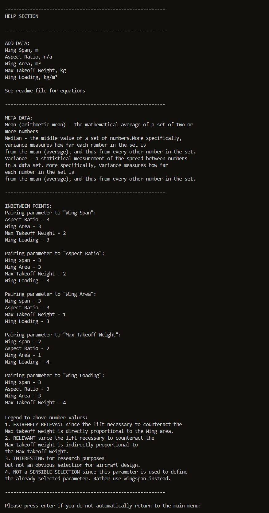
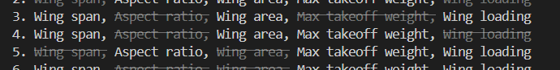

Welcome screen displayed on different devices

# SAPPERLOT

SAPPERLOT is a retro-style terminal program, written in python, that calculates parameters such as "Wing Area" and "Max Takeoff Weight" for planned aircraft designs using data from existing aircrafts. This generation of "start values" is achieved by creating and accessing a data base with aircrafts and interpolate/extrapolate these values. The programs also allow the user to update, search the database and analyse the data.

This program is targeting aircraft designers who would like to automate the process of generating start values for Design algorithms and methods within the field of Aircraft Conceptual Design.

The program name SAPPERLOT is a German interjection to exclaimed surprise, similar to "Oh my goodness!" It is also an acronym: "Statistical Airplane Potent Parameter Engineering Radical Loaded Oranges Tool" to parody industries often contrived projects acronyms.

### Fictive inspirational background story
The year is 1982 and the Swedish government has just given the go ahead for the development of a new national fighter aircraft. A few months earlier a newly graduated computer Scientist from Linköping University has started his first job at the conceptual design department at the national airplane manufacturer Saab in Linköping.

During a coffee break on a Friday afternoon he overhears some colleagues discussing the time-consuming process of manually guesstimating start values for the design algorithms. Eager to impress he calls his girlfriend saying that he can’t make it this weekend. Instead, he huddles over his Commadore 64 and when he leaves his apartment in the suburbs of Ryd Monday morning there is, in his backpack, a golden 3+1⁄2-inch floppy disk with a carefully written name: SAPPERLOT on its label. He bicycles with a new stride through the forest and walks into the department with a swagger feeling he is hot shit!

His colleague’s initial silent skepticism turns to raised eyebrows and happy chuckles as the command line prompt spits out the start values for the day. Today he is close to retirement but remembering that code and the early planning of JAS 39 Gripen still puts a sweet smile on his face.

Please note: There is sometimes a delay of a few seconds before the welcome screen appears. We sincerely apologize for this inconvenience. For more information see section: "Unsolved bugs"

[View the live project here.](https://sapperlot-8eb16827aadb.herokuapp.com/)

##  User Experience (UX)

- ### As a User, I want to be able to:
1. Clearly understand how to use and navigate the program.
2. Easily find a help-section with technical background info on how the results are being calculated.
3. Receive feedback and help for my selections based on my previous selections, e.g. receive info on data-set boundaries before inputting my interpolate-value.
4. Always be able to return to the main menu, the help section or to quit the program directly from where I am.
5. Be able to give invalid input without causing the program to crash.
6. Receive valuable data with little effort.

## Features
### Existing Features (In Scope Features)
#### 1. Cloud based spread sheet with aircraft data
[View the aircraft_data - sheet here.](https://docs.google.com/spreadsheets/d/186F_QSx24xYlkzunnzrzawt06MJO8GfdPsxGeRoqIa4/edit#gid=1680754323)
- Google sheet is an "excel clone" spreadsheet that SAPPERLOT use as a library to store aircraft data. The sheet can be accessed from the python code which can update and retrieve the whole sheet, individual tabs, columns, row's or specific cells.
- The filename of the sheet is aircraft_data and it has three tabs at the bottom of the sheet:
  - multirole_fighter
  - airliner
  - general_aviation
- The user can also update the aircraft data directly into the sheet without running SAPPERLOT
- Currently deleting or editing data in the sheet needs to be done directly in the sheet since no function exist for this yet in SAPPERLOT.

#### 2. Welcome message and main menu
- The program has six functions all accessed from the main menu:
  1. Add data
  2. View list of Airplane Categories
  3. View data
  4. Search data
  5. Meta data
  6. Inbetween points

- The user can also always choose "H" to be taken to the HELP section, "M" for going back to the main menu or "Q" if you had enough and want to QUIT the program, no matter from what submenu.
- Run the program by entering python3 run.py in the command line or click the orange "run program"-button
- The Program name/logo displays upon the start of the program together with a welcome message and the main menu.

The Welcome screen as it appear in gitpod:

And the same Welcome screen as it appear in Heroku:

#### 3. Add data (main menu option 1.)
- The add_data() is the most complicated function using four subfunctions called by the add_data() (in the order they are written below):
  1. get_airplane_data() - Prompts and receives airplane user input
  - get_airplane_data() also in turn calls the validate_airplane_data() which test the inputted data (without changing) with the purpose of validating it. 
  2. convert_to_int_and_float() - Leave the first four values as strings, Convert year (fifth value, index 4) to an int and the rest (sixth to ten, index 5 to 9) to float
  3. uppdate_dependent_airplane_data() - Calculates the two missing parameters (inputed as zero by the user).
  4. push_airplane_data_to_worksheet() - Updates the inputted values as a new row in correct category/tab in the google worksheet

- The five aircraft parameters are interdependent and inputting more than three parameters would therefore overdefine the data. For this reason, the user need to first select which set of parameters to input. The rest of the parameters will be calculated by SAPPERLOT.
- After this the user can input the data for an aircraft as a Comma Separated Values (CSV).
- The user will be given feedback on which parameters to leave out (entering "0" as placeholders for these values) based on his selection.

#### 4. Equations for calculation of dependent parables
- The uppdate_dependent_airplane_data() function calculates the two missing parameters (inputed as zero by the user). 
- This function displays all the categories in the sheet aircraft_data (tabs in aircraft_data sheet).
- The function does not require any additional selection steps.
- If these would be inputted it would overdefine the user data. See the below equations used to calculate the dependent values.

#### 5. View list of Airplane Categories (main menu option 2.)
- This function displays all the categories in the sheet aircraft_data (tabs in aircraft_data sheet).
- The function does not require any additional selection steps.

#### 6. View data (main menu option 3.)
- This function retrieves all data in the aircraft_data-sheet and display it as a simple printout to the screen.
- The function requires the user only one selection namely that of "aircraft category".

#### 7. Search data (main menu option 4.)
- This function allows the user to search the aircraft_data sheet for entries
- The user need to make two selection steps before he can enter the search term:
  1. category
  2. Exact word search or Regular expression (regex) search

and for case of Regular expression, regex (case sensitive)

#### 8. Meta data (main menu option 5.)
- This function is simple to use (yet slightly more complex under the hood) and give the user info about the characteristics of the "data base".
- The function does not require any additional selection steps.
- The three parameters: mean, median and variance is calculated using a built-in statistics module in python.

 
#### 9. Inbetween points (main menu option 6.)
- The function of interpolating points that lie between the datapoints really is the main purpose of SAPPERLOT.
- numpy.interp is used to interpolate the data. Numpy is a python module handling everything math and since it is written in C++ it is faster than Python's native list operations.
- The user need to make four selections/values before the "in-between"-value is displayed
  1. category
  2. Aircraft data parameters (y-coord.) to calculate "inbetween"-value3
  3. Aircraft data parameters (x-coord.) to base "in-between"-value on. Feedback on which parameter the user is not allowed to select is given.
  4. The interpolation value (y-coord.). Feed back on data set bounds are given

#### 9. Help section (main menu option H)
- This section gives some general information and more specific advice for selecting parameters in the inbetween points function

#### 10. Error handling
- All user selection processes try to take care of incorrect user input without crashing by testing using a try and except-statement.
- The following user inputs errors are checked for:
  - Correct number of inputs, e.g. for airplane data in add_data function
  - No commas in year in airplane data in add_data function
  - input Category (multirole_fighter, airliner or general_aviation) need to be spelled correctly (including underscore)

### Features Left to Implement (Out of Scope Features for a future release)
- Review of complete code structure (especially the user selection process) to evaluate if repeating code patterns could be abstracted away 
  into separate functions in order to decrease complexity
- Adding following functionality:
  - Graphic illustrations of aircraft data (graphs can be implemented in a CLI via e.g. pandas API)
  - Bell curve (to be added to the Meta data function)
  - An edit_data and delete_data function
  - Function to allow user to create new airplane categories/new tabs in google sheet
  - Units to answers in interpolation function
  - Ability to store calculated interpolated values in a new tab in aircraft_data sheet
  - Add to Help section

## UX Design
### Graphics
- The user interface is a Retro style Command Line bringing nostalgic vibes to nerds of my generation.
- Surprisingly much graphics can be achieved with this limited Interface of only rows of chars and whitespaces
- A modest example command line interface graphics is the styling of the Welcome screen together with the logo for SAPPERLOT
- The logo uses 033[1;34;40m blue (using ANSI escape codes and colorama, a built-in Python module) and Unicode Character “◗” (U+25D7). See website: [Compart:](https://www.compart.com/en/unicode/U+25D7)

- The list of input parameters with greyed out and strikedout esc('238;2;9') parameters in the add_data function also use escape codes

### Structure and navigation
- Care have been taken to write the instructions and feedback as clear and unambiguous yet at the same time as short and concise as possible.
- Representing user options with a number (as single letters) instead of command words is to make the user selection/typing process more expedient.
- After the completion of a function/option the user will always return to the main function making navigation easy to understand. The user can also always get back to the main menu by writing M, quit the program typing Q or go to the Help section typing H. 

## Data-Model 
- I have based the model on functions used as the steps to request, validate and return data from the customer.
- SAPPERLOT then push and pull this data to a cloud based google sheet (very similar to Microsoft Excel) which act as a data storage/library.
- The sheet can be accessed from the python code which can update and retrieve the whole sheet, individual tabs, columns, rows or specific cells.
- The filename of the sheet is aircraft_data and it has three tabs at the bottom:
  - multirole_fighter
  - airliner
  - general_aviation
- The user can also update the aircraft data directly into the sheet without running SAPPERLOT
- Currently deleting or editing data in the sheet needs to be done directly in the sheet since no function exist for this yet in SAPPERLOT.

[View the aircraft_data - sheet here.](https://docs.google.com/spreadsheets/d/186F_QSx24xYlkzunnzrzawt06MJO8GfdPsxGeRoqIa4/edit#gid=1680754323)

The program structure/flow chart below shows the overal structure and logic of SAPPERLOT. Some subfunctions/subroutines have been omitted in the chart for sake of clarity.

## Technologies Used

- [Python:](https://www.python.org/) Programming language used.
- [Am I Responsive:](http://ami.responsivedesign.is) Checking how app appears on different screens.
- [PEP8:](http://pep8online.com/) Check code for PEP8 requirements.
- [autopep8:](https://pypi.org/project/autopep8/) Check code in GitPod cloudbased IDE for PEP8 requirements (command: autopep8 --in-place --aggressive --aggressive -r *.py).
- [Lucidchart:](https://www.lucidchart.com/pages/) Used to create structure/low charts.
- [GitPod](https://www.gitpod.io/) used as cloud based IDE (pushing to GitHub).
- [GitHub:](https://github.com/) Used for code storage (code pushed from GitPod).
- [Heroku:](https://devcenter.heroku.com/articles/heroku-dashboard) Used for deployment of app.
- [Stackoverflow:](https://stackoverflow.com/) Used for help on code issues.
- [W3 Schools:](https://www.w3schools.com/python/default.asp) Used for help on code issues.

## Testing
Testing the code for all combinations of selections and input (including invalid user input) has been a major part of the development of SAPPERLOT

### Validator Testing 
- The code has been written according to the [PEP8 guidlines.](https://peps.python.org/pep-0008/)
- The code has passed the online [CI Python Linter](https://pep8ci.herokuapp.com/) without any errors.

### Further Testing

#### I have validated that:

  - the dependent values (calculated by the program based on user input) are correct 
  - That all combinations of selections runs as expected, e.g. category: opt 1 multirole_fighter -> opt 2. Regular expression (regex)
  - data in the wrong form, e.g. decimal number inputed as a year, inputted is handled without causing program to crash
  - Logo, welcome text and all print statements work and displays correctly in terms of color, strikethrough, empty rows/new row using the new line character “\n”

### Solved bugs
- Value not updated:
  - P - value in for loop not updating last index 
  - S - Adding 1 to max index in for loop so that last loop also runs
- Wrong variable used:
  - P - index of a loop on the second level instead of the index of the loop in the correct thride level loop was used.
  - S - change to correct index-variable
- Convert str to int:
  - P - Fifth value (year) in aircraft_data cannot be converted from str to int 
  - S - remove the thousand divider (a comma added by google sheets): values_list[k] = values_list[k].replace(',', '')

- Styling overflow:
  - P - Escape code was not correctly applied so that styling applied to complete code instead of only logo.
  - S - Correcting syntax
- F-string placeholder not recognised by code:
  - P - Printout statement printing variable name to screen instead of its value
  - S - Repeating the f on each line when carrying out line wrap so f-string placeholder would be recognised again by the code.
- Heroku missing numpy:
  - P - Error message in Heroku because numpy was not included in deployment since it was not included in the requirements.txt-file
  - S - run pip freeze --local > requirements.txt in the command line to include numpy (numpy==1.26.4) in the requirements.txt - file and then push to gitHub.

- Contradictory user feedback in search function:
  - P - Search using opt 1: "Exact word search" still print out that search word is found
  - S - Making both opt 1 and option 2 (regex search) use findall which returns an empty list (find returns a None) so that same criteria (if cell != []:) can be used for both.
- The most confusing bug:
  - P - 3 min delay for the Welcome screen to appear in Heroku. Loading time for imported libraries was suspected and removing some appear to solve the delay in gitpod yet not in Heroku. After some time it did work. Linting (has been made in-between). The case remains is inconclusive!

### Known unsolved bugs
- Delay of program startup:
  - P - A delay (3 sec in gitpod, 3 min in Heroku) before Welcome screen appears.
  - S - There is sometimes a delay of a few seconds before the welcome screen appears.
- Remaining Issues relating to deployment on Heroku:
  - Since colorama api does not works with Heroku the logo displays with a wrong character and a grey background instead of black.
  - Heroku display the text with no left margin.

## Deployment
Please note: There is sometimes a delay of a few seconds before the welcome screen appears. We sincerely apologize for this inconvenience. For more information see section: "Unsolved bugs"
which runs in the Code Institute mock terminal on Heroku.

https://sapperlot-8eb16827aadb.herokuapp.com/

The site was deployed to Heroku. The steps to deploy are as follows:
  1. Log in to Heroku.
  2. Click "Create new app".
  3. Choose app name and choose a region.
  4. Click "Create app".
  5. Navigate to the "settings" tab.
  6. "Click "Reveal Config Vars".
  7. Add Config Var in Heroku's Settings. The key is PORT and the value is 8000
  8. Scroll down to "Buildpacks".
  9. Click "Add Buildpack".
  10. First add "python", click save.
  11. Second add "nodejs", click save.

### Automated Deployments from GitHub disabled by Heroku.

Follow the steps below to deploy from your Gitpod workspace:
  1. Open the terminal.
  2. command: heroku login -i
  3. Get your app name from heroku.
  4. command: heroku apps
  5. Set the heroku remote. (Replace <app_name> with your actual app name and remove the <> characters)
  6. command: heroku git:remote -a <app_name>
  7. Add and commit any changes to your code if applicable
  8. command: git add . && git commit -m "Deploy to Heroku via CLI"
  9. Push to both GitHub and Heroku
  10. command: git push origin main
  11. command: git push heroku main

## Credits

- [loveSandwiches, AJGreaves at Code Institute](https://github.com/Code-Institute-Solutions/love-sandwiches-p5-sourcecode/tree/master/05-deployment/01-deployment-part-1) for code based on validation and pushing and pulling data between python code and google sheet
- [Stackoverflow](https://stackoverflow.com/questions/287871/how-do-i-print-colored-text-to-the-terminal) How do I print colored text to the terminal.
- Codesnippet from [geeksforgeeks](https://www.geeksforgeeks.org/python-sort-values-first-list-using-second-list/) making data to be ascending which is a requirment for the interpolate function
- [mittnamnkenny](https://github.com/mittnamnkenny/hangman-game) for the deployment section and general inspiration of layup

### Acknowledgements
- My mentor Brian Macharia for his professionalism, patiens and friendly manners during the code review sessions!
